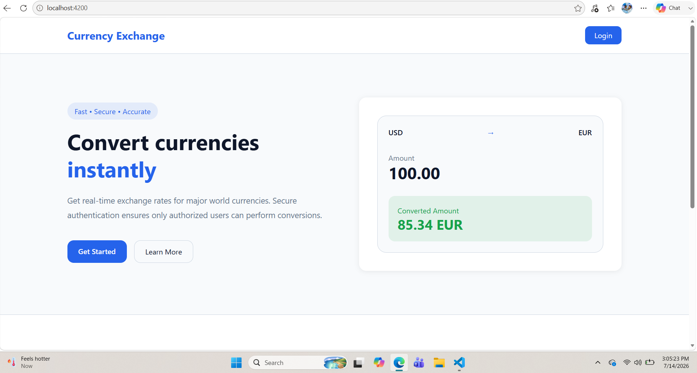
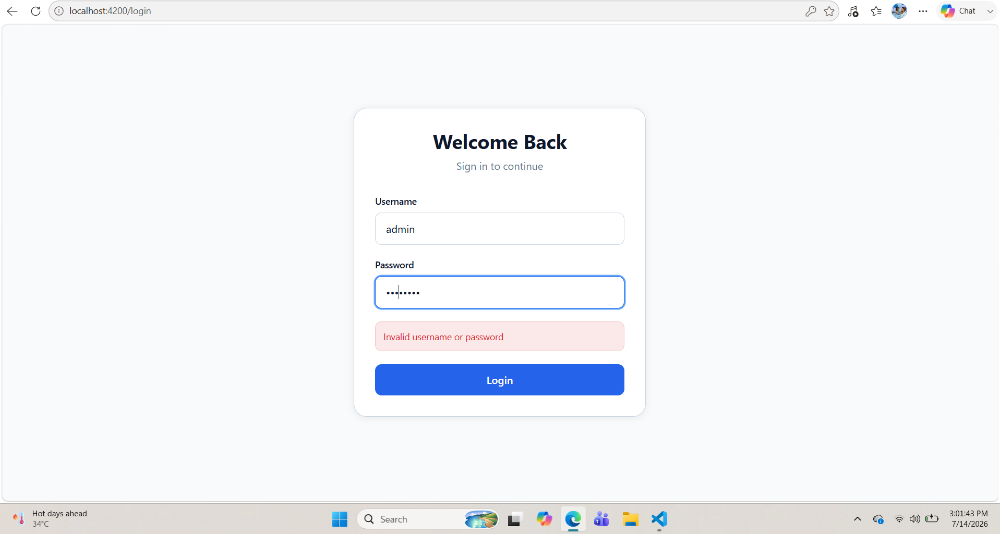
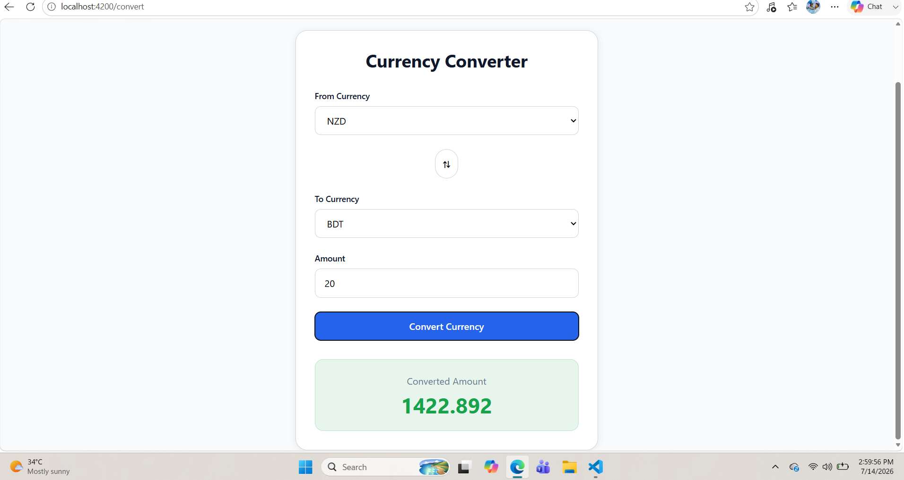

# Currency Exchange System

A full-stack currency exchange application built with Angular 22 and ASP.NET Core Web API.

The application allows users to securely log in and convert currencies using real-time exchange rates. It uses JWT authentication to protect API endpoints and Angular route guards to restrict access to the currency converter page.

## Screenshots

### Home Page




### Login Page




### Currency Converter




## Features

- User authentication with JWT
- Protected API routes
- Protected Angular routes
- Currency conversion using external exchange rate API
- Responsive UI with Tailwind CSS
- Automatic Bearer token handling with HTTP interceptor


## Technologies Used

### Frontend
- Angular 22
- TypeScript
- Tailwind CSS
- RxJS

### Backend
- ASP.NET Core Web API
- C#
- JWT Authentication
- Dependency Injection


## Demo Login

Use these credentials to test the application:

```
Username: Abir
Password: password123
```

## API Routes

Base URL:

```
https://localhost:5031/api
```

### Authentication

#### Login

```
POST /api/auth/login
```

Request:

```json
{
  "username": "Abir",
  "password": "password123"
}
```

Response:

```json
{
  "token": "jwt-token"
}
```

The returned JWT token is stored on the client and automatically sent with protected requests.

## Currency API Setup

This project uses ExchangeRate-API for currency conversion.

Create an account at:

https://www.exchangerate-api.com/

Add your API key:

```json
"Currency": {
  "Key": "YOUR_API_KEY"
}


## Currency Conversion

### Convert Currency

```
GET /api/currency/convert
```

Authorization:

```
Bearer Token Required
```

Parameters:

```
fromCurrency
toCurrency
amount
```

Example:

```
GET /api/currency/convert?fromCurrency=USD&toCurrency=BDT&amount=100
```

Response:

```json
{
  "fromCurrency": "USD",
  "toCurrency": "BDT",
  "amount": 100,
  "convertedAmount": 12150
}
```


## Project Structure

Backend:

```
Controllers
Services
Interfaces
DTOs
Exceptions
```

Frontend:

```
components
core
 ├── services
 ├── guards
 └── interceptors
app.routes.ts
```


## Running the Project

### Backend

```bash
dotnet run
```

### Frontend

Install dependencies:

```bash
npm install
```

Run Angular:

```bash
ng serve
```

Frontend runs on:

```
http://localhost:4200
```


## Future Improvements

- Currency conversion history
- User profiles
- Exchange rate charts
- Favorite currencies
- Admin dashboard


## Author

Developed as a full-stack currency exchange application using Angular and ASP.NET Core.
